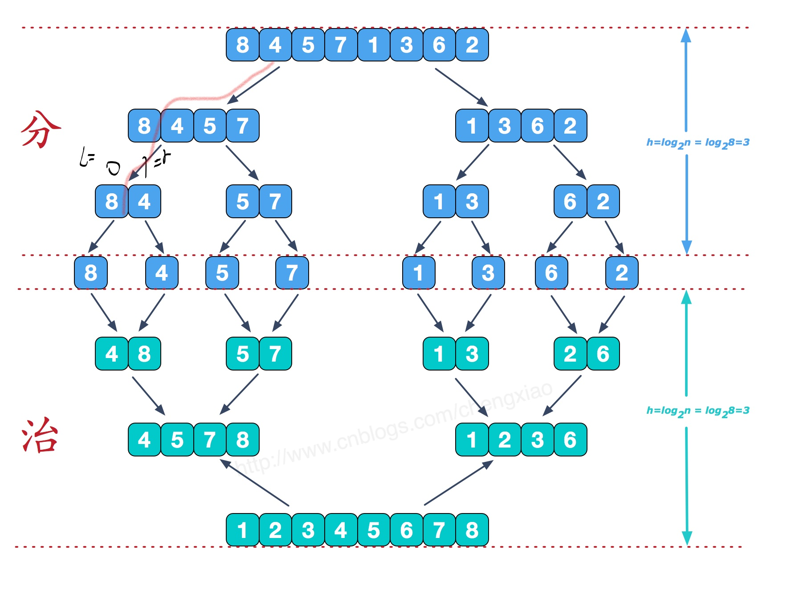
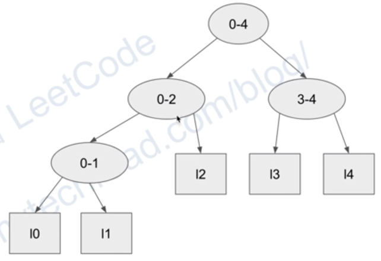

 
### 归并排序
```cpp
#include <bits/stdc++.h>
using namespace std;
#define M 1000
void Merge(int *arr,int l,int mid,int r,int *temp)
{
    int iL = l,iR = mid;
    int jL = mid+1,jR = r;
    int cnt = 0;
    while( iL<=iR && jL<=jR )
    {
        if( arr[iL]<arr[jL] )
        {
            temp[cnt++] = arr[iL++];
        }
        else
        {
            temp[cnt++] = arr[jL++];
        }
    }
    while( iL<=iR )
        temp[cnt++] = arr[iL++];
    while( jL<=jR )
        temp[cnt++] = arr[jL++];

    for( int i=0; i<cnt; i++) //修改原数组
        arr[l+i] = temp[i];

}
void Sort(int *arr,int l,int r,int *temp)
{
    if( l<r )   //分到 只剩一个元素时，数组有序
    {
        int mid = (l+r) / 2;
        Sort(arr,l,mid,temp);
        Sort(arr,mid+1,r,temp);
        Merge(arr,l,mid,r,temp);  //将两个有序数列合并
    }
}

int main()
{
	int arr[M];
    srand(time(NULL));
    for(int i=0; i<M; i++)
    {
        arr[i] = rand()%M;
    }
    int temp[M];		//记录排序数组
    Sort(arr, 0, M-1, temp);
    for(int i=0; i<M; i++)
    {
        cout<<arr[i]<<" ";
    }
    return 0;
}
```

### 衍生：合并k个有序链表  

```cpp
// leetcode 23
struct ListNode {
    int val;
    ListNode *next;
    ListNode(int x) : val(x), next(NULL) {}
};
ListNode* mergeTwoLists(ListNode* l1, ListNode* l2) {
    ListNode* h = NULL,*p = NULL;
    if(l1==NULL)
    {
        return l2;
    }
    if(l2==NULL)
    {
        return l1;
    }
    if(l1->val < l2->val){
        h = l1;
        l1 = l1->next;
    }
    else{
        h = l2;
        l2 = l2->next;
    }
    p = h;
    while(l1!=NULL || l2!=NULL)
    {
        if(l1==NULL){
            p->next = l2;
            p = p->next;
            l2 = l2->next;
            continue;
        }
        if(l2==NULL){
            p->next = l1;
            p = p->next;
            l1 = l1->next;
            continue;
        }
        if(l1->val < l2->val)
        {
            p->next = l1;
            p = p->next;
            l1 = l1->next;
        }
        else{
            p->next = l2;
            p = p->next;
            l2 = l2->next;
        }
    }
    p->next = NULL;
    return h;
}

ListNode* sortLists(vector<ListNode*>& lists,int l,int r)
{
    if(l == r)
        return lists[l];
    if(l < r)
    {
        int m = (l+r)/2;
        ListNode *l1 = sortLists(lists, l, m);
        ListNode *l2 = sortLists(lists, m+1, r);
        return mergeTwoLists(l1, l2);
    }
}
ListNode* mergeKLists(vector<ListNode*>& lists)
{
    if(lists.size() == 0)
        return nullptr;
    return sortLists(lists, 0, lists.size()-1);

}
```

### 链表的归并排序
```cpp
// leetcode 148
struct ListNode {
    int val;
    ListNode *next;
    ListNode(int x) : val(x), next(NULL) {}
};
ListNode* creat()
{
    int v;
    ListNode* h = new ListNode(0);
    ListNode* tail = h;
    for(int i=0; i<4; i++)
    {
        scanf("%d", &v);
        ListNode* t = new ListNode(v);
        tail->next = t;
        tail = t;
    }
    tail->next = nullptr;
    return h;
}
void pr2(ListNode* head)
{
    ListNode* h = head->next;
    ListNode* fasth = h->next;
    while(fasth)
    {
        cout<<h->val<<"-"<<fasth->val<<endl;
        h = h->next;
        fasth = fasth->next;
        if(!fasth)
            break;
        fasth = fasth->next;
    }
    putchar('\n');
}
void pr(ListNode* h1)
{
    ListNode* n1 = h1->next;
    while(n1)
    {
        cout<<n1->val<<" ";
        n1 = n1->next;
    }
    putchar('\n');
}
void prswap(ListNode* h1,ListNode* h2)
{
    ListNode* n1 = h1->next;
    ListNode* n2 = h2->next;
    swap(n1, n2);
    while(n1 && n2)
    {
        cout<<n1->val<<"-"<<n2->val<<endl;
        n1 = n1->next;
        n2 = n2->next;
    }
    putchar('\n');
}


ListNode* mergeTwoLists(ListNode* l1, ListNode* l2) {
    ListNode dummy(0);
    ListNode* tail = &dummy;  // = 地址
    while(l1 && l2)
    {
        if(l1->val > l2->val)
            swap(l1, l2);       // 相当于整个list交换
        tail->next = l1;
        tail = tail->next;
        l1 = l1->next;
    }
    if(l1)
        tail->next = l1;
    if(l2)
        tail->next = l2;
    return dummy.next;
}

ListNode* sortList(ListNode* head) {

    if(!head || !head->next)
        return head;

    ListNode* slow = head;       // 快慢指针 --> 中点
    ListNode* fast = head->next;
    while(fast && fast->next)
    {
        slow = slow->next;
        fast = fast->next->next;
    }
    ListNode* mid = slow->next;  // 左链表的尾:slow 右链表的头:mid
    slow->next = nullptr;        // 分开
    return mergeTwoLists( sortList(head), sortList(mid) );  // 回溯时合并两有序链表
}
int main()
{
    ListNode* h1 = creat();
    h1 = sortList(h1);
    pr(h1);
    return 0;
}
```

### 对链表自底向上(Buttom up): space -> O(1)  
_占位符_  

### 求逆序数
```cpp
// leetcode 775 merge时顺便计算逆序数
int Merge(vector<int>& arr,int l,int mid,int r,vector<int>& temp)
{
    int inv = 0;
    int iL = l,iR = mid;
    int jL = mid+1,jR = r;
    int cnt = 0;
    while( iL<=iR && jL<=jR )
    {
        if( arr[iL]<arr[jL] )
        {
            temp[cnt++] = arr[iL++];
        }
        else
        {
            temp[cnt++] = arr[jL++];
            inv += iR - iL + 1;  // 此+后面 的个数
                                 // inv 仅在此产生
        }
    }
    while( iL<=iR )
        temp[cnt++] = arr[iL++];
    while( jL<=jR )
        temp[cnt++] = arr[jL++];

    for( int i=0; i<cnt; i++) //修改原数组
        arr[l+i] = temp[i];
    return inv;
}
int Sort(vector<int>& arr,int l,int r,vector<int>& temp)
{
    int inv_l=0,inv_r=0,inv_cur=0;
    if( l<r )   //分到 只剩一个元素时，数组有序
    {
        int mid = (l+r) / 2;
        inv_l = Sort(arr,l,mid,temp);
        inv_r = Sort(arr,mid+1,r,temp);
        inv_cur = Merge(arr,l,mid,r,temp);  //将两个有序数列合并
        return inv_l+inv_r+inv_cur;
    }
    return 0;  // l >= r  初始inl,inr = 0
}
bool isIdealPermutation(vector<int>& A)
{
    int len = A.size();
    int loc = 0;
    for(int i=0; i<len-1; i++)
        if(A[i]>A[i+1])
            loc++;
    vector<int> temp(len);
    return loc == Sort(A, 0, len-1, temp);
}
```


 