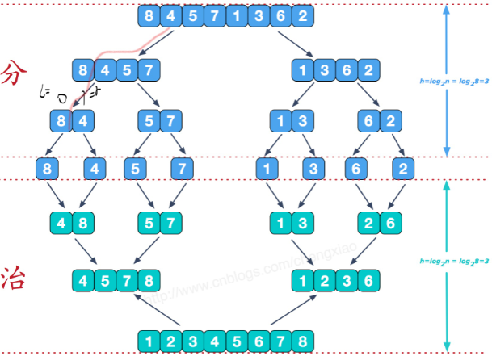

  
```cpp
#include <bits/stdc++.h>
using namespace std;
#define M 1000
void Merge(int *arr,int l,int mid,int r,int *temp)
{
    int iL = l,iR = mid;
    int jL = mid+1,jR = r;
    int cnt = 0;
    while( iL<=iR && jL<=jR )
    {
        if( arr[iL]<arr[jL] )
        {
            temp[cnt++] = arr[iL++];
        }
        else
        {
            temp[cnt++] = arr[jL++];
        }
    }
    while( iL<=iR )
        temp[cnt++] = arr[iL++];
    while( jL<=jR )
        temp[cnt++] = arr[jL++];

    for( int i=0; i<cnt; i++) //修改原数组
        arr[l+i] = temp[i];

}
void Sort(int *arr,int l,int r,int *temp)
{
    if( l<r )   //分到 只剩一个元素时，数组有序
    {
        int mid = (l+r) / 2;
        Sort(arr,l,mid,temp);
        Sort(arr,mid+1,r,temp);
        Merge(arr,l,mid,r,temp);  //将两个有序数列合并
    }
}

int main()
{
	int arr[M];
    srand(time(NULL));
    for(int i=0; i<M; i++)
    {
        arr[i] = rand()%M;
    }
    int temp[M];		//记录排序数组
    Sort(arr, 0, M-1, temp);
    for(int i=0; i<M; i++)
    {
        cout<<arr[i]<<" ";
    }
    return 0;
}
```

衍生：合并k个有序链表  

```cpp
// leetcode 23
struct ListNode {
    int val;
    ListNode *next;
    ListNode(int x) : val(x), next(NULL) {}
};
ListNode* mergeTwoLists(ListNode* l1, ListNode* l2) {
    ListNode* h = NULL,*p = NULL;
    if(l1==NULL)
    {
        return l2;
    }
    if(l2==NULL)
    {
        return l1;
    }
    if(l1->val < l2->val){
        h = l1;
        l1 = l1->next;
    }
    else{
        h = l2;
        l2 = l2->next;
    }
    p = h;
    while(l1!=NULL || l2!=NULL)
    {
        if(l1==NULL){
            p->next = l2;
            p = p->next;
            l2 = l2->next;
            continue;
        }
        if(l2==NULL){
            p->next = l1;
            p = p->next;
            l1 = l1->next;
            continue;
        }
        if(l1->val < l2->val)
        {
            p->next = l1;
            p = p->next;
            l1 = l1->next;
        }
        else{
            p->next = l2;
            p = p->next;
            l2 = l2->next;
        }
    }
    p->next = NULL;
    return h;
}

ListNode* sortLists(vector<ListNode*>& lists,int l,int r)
{
    if(l == r)
        return lists[l];
    if(l < r)
    {
        int m = (l+r)/2;
        ListNode *l1 = sortLists(lists, l, m);
        ListNode *l2 = sortLists(lists, m+1, r);
        return mergeTwoLists(l1, l2);
    }
}
ListNode* mergeKLists(vector<ListNode*>& lists)
{
    if(lists.size() == 0)
        return nullptr;
    return sortLists(lists, 0, lists.size()-1);

}
```
