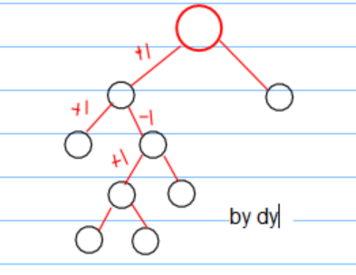

###进出栈
+1, +1, -1, +1, +1, -1, -1, -1.  
有进才能出，前缀和非负。
###二叉树
n+1个叶子节点构成种数。先左后右。  
  
###平衡括号  
(()(()))   

  

```cpp
#define M 35
ll C[M+1];
void catalan()
{
    C[0]=C[1]=1;
    for(int i=2; i<=M; i++)
    {
        C[i]=0;
        for(int j=0; j<i; j++)
            C[i] += C[j]*C[i-j-1];
    }
}
```
